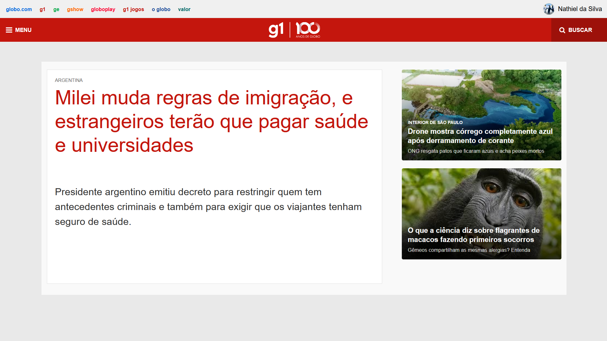

# PROJETO DE TELA G1

SITE DA GLOBO REFEITO COM HTML E CSS

##  COMO USAR?

1. Clone o repositorio

2. Instale as dependencias

3. Execute

---

#### CODIGOS:

- HTML
- CSS
- RESET DO CSS

Projeto feito por Nathiel da Silva Santos